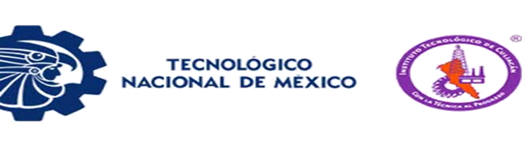

  

# Presentacion
- Instituto Tecnológico de Culiacán
- Carrera: Ing. Tecnologías de la información y comunicaciones 
- TOPICOS DE INTELIGENCIA ARTIFICIAL
- DR. ZURIEL DATHAN MORA FELIX
- Grupo: 12:00 – 01:00 PM 
- Alumno: Rodrigo Alonso Páez Gastélum
- Número de control: 20170080

# Repositorio Tópicos de inteligencia artificial 
  Cada carpeta tiene un readme
  - el readme raíz (este mismo) donde se explica que se hizo en la tarea de manera breve 
  - readme del módulo, donde se explica cosas que conciernen al módulo general, lleva que llevan las carpetas de cada tarea
  - readme de tarea, donde se explica de manera más extendida la realización de la tarea en especifico
## Unidad 1
la carpeta de unidad 1 contiene las tareas relacionadas a la unidad 1
- contiene 3 carpetas y su readme para explicar cada uno de las tareas de la unidad

## Unidad 2 
La capeta de unidad 2 contiene las tareas relacionada con el módulo 2 

- La tarea 1 es una investigación de 4 metodos de heurística 
- La tarea 2 es un ejemplo de codigo para la solucion de 8 reinas con el algoritmo tabú.
- La tarea 3 es un ejemplo de solucion de codigo para el algoritmo de recocido simulado.
## Unidad 3
La carpeta de unidad 3 contiene 3 carpetas con la correspondiente tarea
- la tarea uno es sobre Evolucion diferencial es una investigacion en diapositiva
- La segunda tarea es un ejemplo del codigo de una particula
- la tercer tarea es un ejemplo de el funcionamiento de una particula
- La cuarta tarea es el algoritmo genetico para el problema del agente viajero